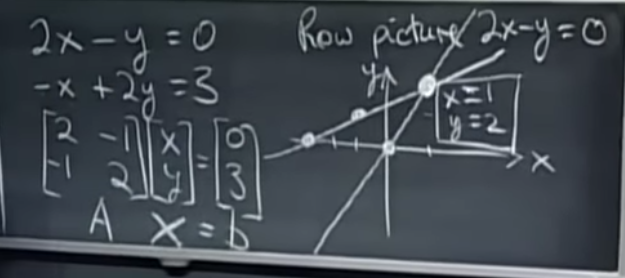
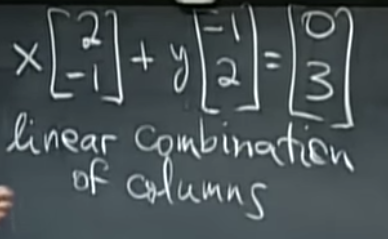
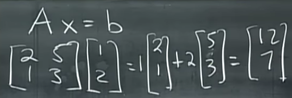

# LLM-FastTrack

This is where I'm keeping track of everything I learn about Large Language Models.
It's straightforward – notes, code, and links to useful resources.

## What's Inside

- **Notes:** Quick thoughts, summaries, and explanations I've written down to better understand LLM concepts.
- **Code:** The actual code I've written while experimenting with LLMs. It's not always pretty, but it works (mostly).
- **Resources:** Links to articles, papers, and tutorials that have cleared things up for me. No fluff, just the good
  stuff.

## Why This Repo

I needed somewhere to dump my brain as I dive into LLMs. Maybe it'll help someone else, maybe not. But it's helping me
keep track of my progress and organize my thoughts.

Feel free to look around if you're into LLMs or just curious about what I'm learning. No promises, but you might find
something useful.

---

# Studyplan

This is the curriculum I'm following to learn about Large Language Models. It's a mix of PyTorch basics, LLM concepts,
and real-world applications.
The first draft of the study plan has been generated by a LLM and I'll be updating it as I go along.

**Resources:**

| Category | Title+Link                                                                             | Comment                                              |
|----------|----------------------------------------------------------------------------------------|------------------------------------------------------|
| Study    | [How I got into deep learning](https://www.vikas.sh/post/how-i-got-into-deep-learning) | Vikas Paruchuri's journey into deep learning and AI. |

# 1. Getting Good with PyTorch

---

# My Study Notes

Most of my notes will be in the form of notebooks, and I will link them in each section.
I will also write a short summary of the key points I've learned in each section.

### Before getting started

At the moment I prefer to use PyCharmPro as my dev environment. The benefits are venv- and notebook support and full IDE
support (with CoPilot).
If you want to run any of my code, you need to set up and activate a virtual environment and install the required
packages with:

```bash
pip install -r requirements.txt
```

Alternatively follow these installation guides

* https://pytorch.org/get-started
* https://jupyter.org/install

## PyTorch

I am a software engineer and already know how to code. But I am new to the PyTorch library and want to get familiar and
fluent writing code with it before I dive deeper into LLMs.
If you don't know how to program, I would recommend to take at least a short introductory course into Python before
continuing.

If you look at the tools and libraries used to build neural networks, you'll quickly discover that there are many
choices.
You will also see that PyTorch is one of the most popular and upcoming libraries. To start somewhere that is the library
I picked.
For now I am not going to worry about other choices of the need to know them, I'll focus on PyTorch and expand later
when I need to.

[Vikas Paruchuri](https://www.vikas.sh/post/how-i-got-into-deep-learning) said this about proficiency: "You should get
to a point where you can code up any of the main neural networks architectures in plain numpy".
Since PyTorch tensors are very similar to numpy arrays, this will be my goal. And now lets get good with PyTorch
tensors.

### Chapter Overview

1.1.1 **PyTorch Basics**: Tensors, Operations, Autograd system for automatic differentiation, CUDA tensors for GPU
acceleration.

1.1.2. **Neural Networks in PyTorch**: Using `torch.nn`, defining layers, forward pass, loss functions, and optimizers.

1.1.3. **Working with Data**: Datasets, DataLoaders, data preprocessing, and augmentation techniques.

1.1.4. **Model Training and Validation**: Batching, training loops, validation, overfitting, underfitting, and
regularization
techniques.

1.1.5. **Saving and Loading Models**: Checkpoints, saving best models, and model inference.

## 1.1. PyTorch Basics

### 1.1.1. PyTorch Tensors vs Numpy (Arrays)

I did a bit of searching to findout how PyTorch tensors and Numpy arrays are different and how they are similar. Here is
what I found:

PyTorch tensors and NumPy arrays are both powerful tools widely used in the field of data science and machine learning,
especially for array computing and handling large datasets. Despite their similarities, there are fundamental
differences, especially in how they are used within the deep learning context.

#### Similarities between PyTorch Tensors and NumPy Arrays

1. **Data Structure**: Both PyTorch tensors and NumPy arrays provide efficient data structures for storing and
   manipulating numerical data in multi-dimensional arrays. They offer a wide range of functionalities for array
   manipulations such as reshaping, slicing, and broadcasting.

2. **API Overlap and Interoperability**: There is a significant overlap in the APIs between PyTorch and NumPy, making it
   relatively easy for users to switch between the two or to integrate them within the same project. PyTorch tensors can
   be easily converted to and from NumPy arrays, allowing for seamless integration between the two libraries. Functions
   for operations like addition, multiplication, transposition, and more, have similar calling conventions.

3. **Memory Sharing**: PyTorch can interoperate with NumPy through memory sharing. Tensors can be converted to NumPy
   arrays and vice versa without necessarily copying data. This allows for efficient memory usage when transitioning
   between the two during preprocessing or analysis stages.

#### Differences between PyTorch Tensors and NumPy Arrays

1. **Computation Graphs and Backpropagation**: PyTorch tensors are integrated with a powerful automatic differentiation
   library, Autograd. This makes them suitable for building neural networks where gradients are computed for
   optimization. NumPy, on the other hand, does not support automatic differentiation and is typically used for more
   straightforward numerical computations without the need for tracking gradients.

2. **GPU Support**: PyTorch tensors are designed to easily switch between CPU and GPU operations, which is crucial for
   training deep learning models efficiently. NumPy primarily operates on the CPU, meaning operations using NumPy arrays
   do not benefit from GPU acceleration.

3. **Mutable vs Immutable**: When a PyTorch tensor is modified, its underlying data is also modified without the need to
   create a new tensor. In contrast, NumPy operations often result in a new array being created even if the operation
   could be applied in place.

4. **Designed for Deep Learning**: PyTorch is inherently designed for deep learning applications. It provides
   functionalities like tensor operations on GPUs, distributed computing, and more, which are specifically tailored for
   training neural networks. NumPy, while versatile in handling numerical data, lacks these deep learning-specific
   enhancements.

5. **Dynamic vs Static Computing**: PyTorch allows for dynamic computational graphs, meaning the graph is built at
   runtime. This is beneficial for models where the computation cannot be completely described as a static graph
   beforehand. NumPy’s usage scenario doesn’t involve computational graphs and is purely for static array computations.

#### Use Cases

**NumPy** is excellent for tasks that require straightforward numerical computation in science and engineering but do
not need gradients or massive parallelism offered by GPUs.
**PyTorch** is preferable when developing complex models that require gradients, need to run on GPUs for performance, or
when the models involve dynamic changes in the computation process.

#### Summary:

While PyTorch tensors and NumPy arrays share many similarities in terms of their core functionality as n-dimensional
arrays, PyTorch tensors are specifically designed for deep learning and machine learning applications, with features
like automatic differentiation and GPU support, which make them more suitable for these tasks compared to the more
general-purpose NumPy arrays.

#### Conclusion:

Since we are going to get good with LLMs, PyTorch sounds just like what we need. Lets get into it in the next section.

### PyTorch Tensors

I created a Jupyter
Notebook [001-pytorch-tensors.ipynb](https://github.com/florianbuetow/llm-fasttrack/blob/main/notebooks/001-pytorch-tensors.ipynb)
that contains all of my basic experiments with PyTorch tensors.

### Study Notes

I like to keep my notes in a question answering format because it helps with retrieval and interview preparation at the
same time.

| Question                                              | Answer                                                                                                                                                                                                                                  |
|-------------------------------------------------------|-----------------------------------------------------------------------------------------------------------------------------------------------------------------------------------------------------------------------------------------|
| What is a tensor?                                     | A tensor is a multi-dimensional array for numerical computations that can store numerical data. (And it is very similar to a numpy array ot TensorflowTensor                                                                            |
| What is a tensor with rank 0?                         | A 0-dimensional tensor is a scalar that represents a single numerical value.                                                                                                                                                            |
| What is a tensor with rank 1?                         | A 1-dimensional tensor is a vector that represents a list of numerical values.                                                                                                                                                          |
| What is a tensor with rank 2?                         | A 2-dimensional tensor is a matrix that represents a table of numerical values.                                                                                                                                                         |
| What is broadcasting?                                 | Broadcasting is a technique in PyTorch that allows for element-wise operations between tensors of different shapes and sizes, without manually reshaping or duplicating data.                                                           |
| When is a PyTorch tensor "broadcastable"?             | **Rule 1**: Each tensor has at least one dimension. **Rule 2**: When iterating over the dimension sizes, starting at the trailing dimension, the dimension sizes must either be equal, one of them is 1, or one of them does not exist. |
| Why does the choice of data type for a tensor matter? | Choosing the right one is important because it will influence the memory usage and performance                                                                                                                                          |

#### Study Resources

| Category | Title                                                                                        | Comment                                |
|----------|----------------------------------------------------------------------------------------------|----------------------------------------|
| Coding   | 4.3 Vectors, Matrices, and [Broadcasting](https://www.youtube.com/watch?v=4Ehb_is-MFU)       | A YouTube video by Sebastian Raschka   |
| Coding   | [Broadcasting Semantics](https://pytorch.org/docs/stable/notes/broadcasting.html) in PyTorch | Explains how/when broadcasting happens |

# II. Learning about to LLMs

- **Architecture of Transformer Models**: Attention mechanisms, multi-head attention, positional encoding, feed-forward
  networks.
- **Pre-trained Models Overview**: GPT (Generative Pre-trained Transformer), BERT (Bidirectional Encoder Representations
  from Transformers), and variants (RoBERTa, T5, etc.).
- **Tokenization and Embeddings**: WordPiece, SentencePiece, BPE (Byte Pair Encoding), contextual embeddings.
- **Language Modeling**: Unsupervised learning, predicting the next word, understanding context.
- **Evaluation Metrics**: Perplexity, BLEU score, ROUGE, F1 score, accuracy, precision, recall.

# III. Mathematical Foundations

Foundational and advanced mathematical concepts that underpin the workings of Large Language Models (LLMs), especially
those based on the Transformer architecture.

## Chapter Overview

1. **Linear Algebra**:
    - **Vectors and Matrices**: Understanding the basic building blocks of neural networks, including operations like
      addition, multiplication, and transformation.
    - **Eigenvalues and Eigenvectors**: Importance in understanding how neural networks learn and how data can be
      transformed.
    - **Special Matrices**: Identity matrices, diagonal matrices, and their properties relevant to neural network
      optimizations.

## 3.1. Linear Algebra

### Study Notes

This is an overview and/or review of some of the basic concepts in linear Algebra.

**3.1.1. The Geometry of Linear Equations**

Idea: We are looking for a solution of a system of linear equations. For that we are expressing the equations as row
vectors in a matrix.
Then the solution is the to all equations is the vector x in A*x = b.

There are different ways of looking at the matrix and the vectors involved in the Ax = b equation:

**Row picture of a matrix**



**Linear combinations**



**Column picture of a matrix**



**Matrix-Vector multiplication**


You can do it **column based**: Take 1 of the first column and add 2 of the 2nd column

You can do it **row based** (dot product): Dot product of the first row of A with the vector + dot product of the second
of of A with the vector.

| Question                                                                 | Answer                                                                                                                                                                                                                                                                       |
|--------------------------------------------------------------------------|------------------------------------------------------------------------------------------------------------------------------------------------------------------------------------------------------------------------------------------------------------------------------|
| Do the linear combinations of the columns fill n-dimensional space?      | This is the same question as: Does Ax=b always have a solution for x?                                                                                                                                                                                                        |
| Is there always a solution for x in Ax=b?                                | Yes, if A is invertible. Yes, if A is non-singular.                                                                                                                                                                                                                          | 
| Are invertible matrices always non-singular matrices?                    | Yes.                                                                                                                                                                                                                                                                         |
| What is the definition of a singular matrix?                             | A matrix is singular if it does not have an inverse.                                                                                                                                                                                                                         |
| What can you tell about a matrix if its determinant is zero?             | That the matrix has linear dependent row or column vectors                                                                                                                                                                                                                   |
| When is a matrix not invertible?                                         | When it has linear dependent row or column  vectors                                                                                                                                                                                                                          |
| What does the determinant tell us about a matrix?                        | When it is zero the matrix is not invertible. When it is not zero the row and column vectors are linearly independent.                                                                                                                                                       |
| What is the definition of an invertible matrix?                          | A is invertible if A^-1^ exist such that A*A^-1^=I.                                                                                                                                                                                                                          |
| What are some methods that can be used to find the inverse of a matrix   | a) Gaussian Elemination (Row Reduction) b) Matrix Decomposition techniques: LU-decomposition, QR-decomposition, singular value decomposition (SVD).                                                                                                                          |
| When a matrix is invertible, how many solutions can exist for x in Ax=b? | x will always have exactly one solution.                                                                                                                                                                                                                                     |
| When a matrix is singular, how many solutions can exist for x in Ax=b?   | x can have 0 or infinitely many solutions, but never exactly one.                                                                                                                                                                                                            |
| How can Gaussian Elimination fail?                                       | It can fail primarily due to zero pivots that cannot be replaced by row swaps. This often occurs when there is linear dependence among the rows, leading either to no solution (inconsistent system) or to a system with infinitely many solutions (underdetermined system). |
| What does it mean when we find a zero pivot during Gaussian Elimination? | That we have linear dependent rows or columns. Meaning there are either zero or infinitely many solutions to the system of equations.                                                                                                                                        |

**3.1.3. Multiplication and Inverse Matrices**

**3.1.4. Factorization into A = LU**

**3.1.5. Transposes, Permutations, Spaces R^n**

**3.1.6. Column Space and Nullspace**

**3.1.7. Solving Ax = 0: Pivot Variables, Special Solutions**

**3.1.8. Solving Ax = b: Row Reduced Form R**

**3.1.9. Independence, Basis, and Dimension**

**3.1.10. The Four Fundamental Subspaces**

**3.1.11. Matrix Spaces; Rank 1; Small World Graphs**

**3.1.12. Graphs, Networks, Incidence Matrices**

**3.1.13. Quiz 1 Review**

**3.1.14. Orthogonal Vectors and Subspaces**

**3.1.15. Projections onto Subspaces**

**3.1.16. Projection Matrices and Least Squares**

**3.1.17. Orthogonal Matrices and Gram-Schmidt**

**3.1.18. Properties of Determinants**

**3.1.19. Determinant Formulas and Cofactors**

**3.1.20. Cramer's Rule, Inverse Matrix, and Volume**

**3.1.21. Eigenvalues and Eigenvectors**

**3.1.22. Diagonalization and Powers of A**

**3.1.23. Differential Equations and exp(At)**

**3.1.24. Markov Matrices; Fourier Series**

**3.1.24b. Quiz 2 Review**

**3.1.25. Symmetric Matrices and Positive Definiteness**

**3.1.26. Complex Matrices; Fast Fourier Transform**

**3.1.27. Positive Definite Matrices and Minima**

**3.1.28. Similar Matrices and Jordan Form**

**3.1.29. Singular Value Decomposition**

**3.1.30. Linear Transformations and Their Matrices**

**3.1.31. Change of Basis; Image Compression**

**3.1.33. Left and Right Inverses; Pseudoinverse**

**3.1.32. Quiz 3 Review**

**3.1.34. Final Course Review**

#### Study Resources

| Category | Title                                                                                                                                                                 | Comment                 |
|----------|-----------------------------------------------------------------------------------------------------------------------------------------------------------------------|-------------------------|
| Math     | MIC OCW [Linear Algebra, Fall 2011](https://ocw.mit.edu/courses/18-06sc-linear-algebra-fall-2011/pages/ax-b-and-the-four-subspaces/the-geometry-of-linear-equations/) | by Prof. Gilbert Strang |
| Math     | MIT OCW Lecture 1 [The Geometry of Linear Equations](https://www.youtube.com/watch?v=J7DzL2_Na80&list=PL221E2BBF13BECF6C&index=3)                                     | by Prof. Gilbert Strang |
| Math     | MIT OCW Lecture 2 [Elimination with Matrices](https://www.youtube.com/watch?v=QVKj3LADCnA)                                                                            | by Prof. Gilbert Strang |
| Math     | MIT OCW Lecture 3 [Multiplication and Inverse Matrices](https://www.youtube.com/watch?v=FX4C-JpTFgY)                                                                  | by Prof. Gilbert Strang | 

2. **Calculus**:
    - **Derivatives and Gradients**: Essential for understanding the backpropagation algorithm and how neural networks
      learn by minimizing loss functions.
    - **Partial Derivatives and Chain Rule**: Crucial for training models using gradient descent and for understanding
      the autograd system in PyTorch.

3. **Probability and Statistics**:
    - **Probability Theory**: Basics including probability distributions, expectations, variance, and covariance.
    - **Bayesian Methods**: Understanding how prior knowledge is updated with evidence using Bayes' theorem is critical
      for some models and applications.
    - **Statistical Measures**: Mean, median, mode, standard deviation, and their importance in data preprocessing and
      understanding model performance.

4. **Optimization Theory**:
    - **Convex Optimization**: While not all problems in deep learning are convex, the concepts are foundational and
      help in understanding various optimization algorithms.
    - **Gradient Descent and Variants**: Deep dive into how gradient descent works, including its variants like
      stochastic gradient descent (SGD), Adam, etc.
    - **Loss Functions**: Understanding different types of loss functions and their applications in training neural
      networks.

5. **Information Theory**:
    - **Entropy and Information Content**: Basic concepts of information theory that underpin many models' objective
      functions.
    - **Cross-Entropy and KL Divergence**: Important for understanding the loss functions used in training
      classification models and generative models.

6. **Discrete Mathematics**:
    - **Graph Theory**: Useful for understanding attention mechanisms and data structures that represent relationships
      and interactions in data.
    - **Combinatorics**: Foundations for understanding the complexity of model architectures and for tasks such as
      sequence generation.

7. **Numerical Methods**:
    - **Numerical Stability and Conditioning**: Important for training models, especially to understand and mitigate
      issues like vanishing or exploding gradients.
    - **Matrix Decompositions**: Techniques such as singular value decomposition (SVD) and QR decomposition, which are
      useful for certain optimization problems and understanding deep learning models.

# IV. Fine-Tuning and Optimising LLMs

- **Fine-Tuning Techniques**: Transfer learning, learning rate adjustment, layer freezing/unfreezing, gradual
  unfreezing.
- **Optimization Algorithms**: Adam, RMSprop, SGD, learning rate schedulers.
- **Regularization and Generalization**: Dropout, weight decay, batch normalization, early stopping.
- **Efficiency and Scalability**: Mixed precision training, model parallelism, data parallelism, distributed training.
- **Model Size Reduction**: Quantization, pruning, knowledge distillation.

# V. RAG: Retrieval-Augmented Generation

- **Introduction to RAG**: Concept, architecture, comparison with traditional LLMs.
- **Retrieval Mechanisms**: Dense Vector Retrieval, BM25, using external knowledge bases.
- **Integrating RAG with LLMs**: Fine-tuning RAG models, customizing retrieval components.
- **Applications of RAG**: Question answering, fact checking, content generation with external references.
- **Challenges and Solutions**: Handling out-of-date knowledge, bias in retrieved documents, improving retrieval
  relevance.

# VI. Developing real-world Applications with LLMs

- **Integrating LLMs into Applications**: API development, deploying models with Flask/Django for web applications,
  mobile app integration.
- **User Interface and Experience**: Chatbots, virtual assistants, generating human-like text, handling user inputs.
- **Security and Scalability**: Authentication, authorization, load balancing, caching.
- **Monitoring and Maintenance**: Logging, error handling, continuous integration and deployment (CI/CD) pipelines.
- **Case Studies and Project Ideas**: Content generation, summarization, translation, sentiment analysis, automated
  customer service.

---

# Terms and Concepts (uncategorized)

| Keyword                      | Explanation                                                                                                                                                                                                                                                                           | Links                                                                                                       |
|------------------------------|---------------------------------------------------------------------------------------------------------------------------------------------------------------------------------------------------------------------------------------------------------------------------------------|-------------------------------------------------------------------------------------------------------------|
| **Temperature**              | affects the randomness of the model's output by scaling the logits before applying softmax, influencing the model's "creativity" or certainty in its predictions. Lower temperatures lead to more deterministic outputs, while higher temperatures increase diversity and creativity. | [Peter Chng](https://peterchng.com/blog/2023/05/02/token-selection-strategies-top-k-top-p-and-temperature/) 
| **Top P (Nucleus Sampling)** | selects a subset of likely outcomes by ensuring the cumulative probability exceeds a threshold p, allowing for adaptive and context-sensitive text generation. This method focuses on covering a certain amount of probability mass.                                                  | [Peter Chng](https://peterchng.com/blog/2023/05/02/token-selection-strategies-top-k-top-p-and-temperature/) |
| **Top K**                    | limits the selection pool to the K most probable next words, reducing randomness by excluding less likely predictions from consideration. This method normalizes the probabilities of the top K tokens to sample the next token.                                                      | [Peter Chng](https://peterchng.com/blog/2023/05/02/token-selection-strategies-top-k-top-p-and-temperature/) |
| **Q (Query)**                | represents the input tokens being compared against key-value pairs in attention mechanisms, facilitating the model's focus on different parts of the input sequence for predictions.                                                                                                  |
| **K (Key)**                  | represents the tokens used to compute the amount of attention that input tokens should pay to the corresponding values, crucial for determining focus areas in the model's attention mechanism.                                                                                       |
| **V (Value)**                | is the content that is being attended to, enriched through the attention mechanism with information from the key, indicating the actual information the model focuses on during processing.                                                                                           |
| **Embeddings**               | are high-dimensional representations of tokens that capture semantic meanings, allowing models to process words or tokens by encapsulating both syntactic and semantic information.                                                                                                   |
| **Tokenizers**               | are tools that segment text into manageable pieces for processing by models, with different algorithms affecting model performance and output quality.                                                                                                                                |
| **Rankers**                  | are algorithms used to order documents or predict their relevance to a query, influencing the selection of next words or sentences based on certain criteria in NLP applications.                                                                                                     |

# Advice

A collection of quotes, advice, and tips that I've found helpful in my learning journey.

| Category      | Advice                                                                                                                                                                                               | Source                                                                    |
|---------------|------------------------------------------------------------------------------------------------------------------------------------------------------------------------------------------------------|---------------------------------------------------------------------------|
| Study         | Study like there is nothing else to do in your life. Create a plan and stick to it no matter what. No change of directions and no second thoughts.                                                   | [DL Insider](https://twitter.com/dl_insider)                              |
| Study         | Join Discord communities where the latest (state of the art) papers and models are discussed                                                                                                         | [Vikas Paruchuri](https://www.vikas.sh/post/how-i-got-into-deep-learning) |
| Study         | Despite transformers, [CNNs are still widely used](https://twitter.com/rasbt/status/1767561783382872194), and everything [old is new again with RNNs](https://arxiv.org/abs/2402.19427).             | [Vikas Paruchuri](https://www.vikas.sh/post/how-i-got-into-deep-learning) |
| Study         | Learn from examples and create things along the path.                                                                                                                                                | [DL Insider](https://twitter.com/dl_insider)                              |
| Study         | It can take years of hard study to master ML/DL math. And in the end it will help you only in 15% of the cases ... or less.                                                                          | [DL Insider](https://twitter.com/dl_insider)                              |
| Study         | Is is much easier to understand the models from an engineering perspective and then fill the gaps with math.                                                                                         | [DL Insider](https://twitter.com/dl_insider)                              |
| Study         | It is much easier to learn ML as an SWE than the other way around                                                                                                                                    | [Greg Brockman](https://twitter.com/gdb/status/1729893902814192096)       |"
| Coding        | You should get to a point where you can code up any of the main neural networks architectures in plain numpy (forward and backward passes)                                                           | [Vikas Paruchuri](https://www.vikas.sh/post/how-i-got-into-deep-learning) |
| Training LLMs | The easiest entrypoint for training models these days is fine-tuning a base model. Huggingface transformers is great for finetuning because it implements a lot of models already, and uses PyTorch. | [Vikas Paruchuri](https://www.vikas.sh/post/how-i-got-into-deep-learning) |
| Training LLMs | The easiest way to finetune is to pick a small model (7B or fewer params), and try fine-tuning with LoRA.                                                                                            | [Vikas Paruchuri](https://www.vikas.sh/post/how-i-got-into-deep-learning) |
| Training LLMs | Understanding the fundamentals is important to training good models                                                                                                                                  | [Vikas Paruchuri](https://www.vikas.sh/post/how-i-got-into-deep-learning) |
| Training LLMs | You don’t need a lot of GPUs for  fine-tuning                                                                                                                                                        | [Vikas Paruchuri](https://www.vikas.sh/post/how-i-got-into-deep-learning) |
| Impact        | Finetuning is a very crowded space, and it’s hard to make an impact when the state of the art changes every day.                                                                                     | [Vikas Paruchuri](https://www.vikas.sh/post/how-i-got-into-deep-learning) |
| Impact        | Finding interesting problems to solve is the best way to make an impact with what you build                                                                                                          | [Vikas Paruchuri](https://www.vikas.sh/post/how-i-got-into-deep-learning) |
| Impact        | There are many niches in AI where you can make a big impact, even as a relative outsider.                                                                                                            | [Vikas Paruchuri](https://www.vikas.sh/post/how-i-got-into-deep-learning) |

# Reading List

In this section I keep track of all the articles, papers, and tutorials I am reading to learn about LLMs.

**Next Up:**

- [The Essence of Linear Algebra Videos](https://www.youtube.com/watch?v=fNk_zzaMoSs&list=PLZHQObOWTQDPD3MizzM2xVFitgF8hE_ab&pp=iAQB)
  and [as text](https://www.3blue1brown.com/topics/linear-algebra) YouTube playlist/course by 3Blue1Brown
- [Broadcasting in Python (C1W2L15)](https://www.youtube.com/watch?v=tKcLaGdvabM): YT Video by Andrew Ng

**Inbox:**

- [18.06SC | Fall 2011 | Linear Algebra](https://ocw.mit.edu/courses/18-06sc-linear-algebra-fall-2011/pages/ax-b-and-the-four-subspaces/the-geometry-of-linear-equations/)
  lectures by Gilbert Strang
- [Thinking Like Transformers](https://srush.github.io/raspy/)
- [Central Limit Theorem](https://www.youtube.com/watch?v=zeJD6dqJ5lo&list=PLZHQObOWTQDOMxJDswBaLu8xBMKxSTvg8&pp=iAQB)
  by 3Blue1Brown
- [Neural Networks (incl Transformers)](https://www.youtube.com/watch?v=aircAruvnKk&list=PLZHQObOWTQDNU6R1_67000Dx_ZCJB-3pi&pp=iAQB)
  by 3Blue1Brown
- [Probabilities of Probabilities](https://www.youtube.com/watch?v=8idr1WZ1A7Q&list=PLZHQObOWTQDOjmo3Y6ADm0ScWAlEXf-fp&pp=iAQB)
  by 3Blue1Brown
- [Intro to Deep Learning and Generative Models Course](https://www.youtube.com/playlist?list=PLTKMiZHVd_2KJtIXOW0zFhFfBaJJilH51):
  by Sebastian Raschka
- [Let's build the GPT Tokenizer](https://www.youtube.com/watch?v=zduSFxRajkE&t=1s&ab_channel=AndrejKarpathy) by Andrej
  Karpathy
- [What are the recent trends in machine learning, deep learning, and AI](https://twitter.com/rasbt/status/1767561783382872194):
  bySebastian Raschka
- [Retrieval-Augmented Generation (RAG) Made Simple & 2 How To Tutorials](https://spotintelligence.com/2023/10/19/retrieval-augmented-generation-rag/)
- [The 2024 MAD (ML, AI & Data) Landscape](https://mad.firstmark.com)
- [From zero to GPT](https://github.com/VikParuchuri/zero_to_gpt?tab=readme-ov-file): A course by Vikas Paruchuri
- [Neural Networks - From the ground up](https://www.youtube.com/watch?v=aircAruvnKk&list=PLZHQObOWTQDNU6R1_67000Dx_ZCJB-3pi):
  YouTube series from 3Blue1Brown
- [But what is a GPT? Visual intro to transformers](https://www.youtube.com/watch?v=wjZofJX0v4M): Chapter 5, Deep
  Learning
- [Attention in transformers, visually explained](https://www.youtube.com/watch?v=eMlx5fFNoYc&t=308s): Chapter 6, Deep
  Learning
- [Token Selection Strategies: Top-k, Top-p, and Temperature](https://peterchng.com/blog/2023/05/02/token-selection-strategies-top-k-top-p-and-temperature/):
  by Peter Chng
- [Let's build GPT: from scratch, in code, spelled out.](https://www.youtube.com/watch?v=kCc8FmEb1nY): by Andrej
  Karpathy
- [The Illustrated GPT-2](https://jalammar.github.io/illustrated-gpt2/): A visual guide to the GPT-2 model architecture.
- [The Illustrated Transformer](https://jalammar.github.io/illustrated-transformer/): A visual guide to the Transformer
  model architecture.
- [The Annotated GPT-2](https://amaarora.github.io/posts/2020-02-18-annotatedGPT2.html): A detailed explanation of the
  GPT-2 model architecture.
- [The Annotated Transformer](https://nlp.seas.harvard.edu/2018/04/03/attention.html): A detailed explanation of the
  Transformer model architecture.
- [The Transformer: Attention is All You Need](https://arxiv.org/abs/1706.03762): The original paper that introduced the
  Transformer model.
- [GPT-2: Language Models are Unsupervised Multitask Learners](https://cdn.openai.com/better-language-models/language_models_are_unsupervised_multitask_learners.pdf):
  The original paper that introduced the GPT-2 model.
- [GPT-3: Language Models are Few-Shot Learners](https://arxiv.org/abs/2005.14165): The original paper that introduced
  the GPT-3 model.
- [Hugging Face Transformers](https://huggingface.co/transformers/): A library of pre-trained models for NLP tasks.
- [Awesome-LLM](https://github.com/Hannibal046/Awesome-LLM): A curated list of resources for Large Language Models.
- [Building a semantic search engine in Python](https://www.vikas.sh/post/semantic-search-guide) by Vikas Paruchuri
- [Deep Learning Book](https://www.deeplearningbook.org) a book by Ian Goodfellow and Yoshua Bengio and Aaron Courville
  **TIP**: Read only the first 2 parts, skip the 3rd.
- [The Principles of Deep Learning Theory - An Effective Theory Approach to Understanding Neural Networks](https://arxiv.org/abs/2106.10165)
  by Daniel A. Roberts and Sho Yaida
- [Mathematics for Machine Learning](https://mml-book.github.io/book/mml-book.pdf) by Marc Peter Deisenroth A. Aldo
  Faisal Cheng Soon Ong
- [fast.ai](https://www.fast.ai) course(s) by Jeremy Howard
- [Karpathy YouTube](https://www.youtube.com/@AndrejKarpathy) Karpathy videos
- [Efficiently Scaling Transformer Inference](https://arxiv.org/abs/2211.05102)
- [Mixing Gated Linear Recurrences with Local Attention for Efficient Language Models](https://arxiv.org/abs/2402.19427):
- [NEURAL MACHINE TRANSLATION BY JOINTLY LEARNING TO ALIGN AND TRANSLATE](https://arxiv.org/pdf/1409.0473.pdf): RNN
  attention
- [Attention Is All You Need](https://arxiv.org/abs/1706.03762): Transformers
- [Switch Transformers: Scaling to Trillion Parameter Models with Simple and Efficient Sparsity](https://arxiv.org/abs/2101.03961):
  Switch transformer
- [LoRA: Low-Rank Adaptation of Large Language Models](https://arxiv.org/abs/2106.09685): LoRA
- [An Image is Worth 16x16 Words: Transformers for Image Recognition at Scale](https://arxiv.org/abs/2010.11929): Vision
  Transformer
- [Decoupled Weight Decay Regularization](https://arxiv.org/abs/1711.05101): AdamW
- [Language Models are Unsupervised Multitask Learners](https://paperswithcode.com/paper/language-models-are-unsupervised-multitask):
  GPT-2
- [Griffin: Mixing Gated Linear Recurrences with Local Attention for Efficient Language Models](https://arxiv.org/abs/2402.19427):
  RNNs
- [CNNs are still widely used](https://twitter.com/rasbt/status/1767561783382872194): Tweet by Sebastian Raschka
- [Super Easy Way to Get Sentence Embedding using fastText in Python](https://towardsdatascience.com/super-easy-way-to-get-sentence-embedding-using-fasttext-in-python-a70f34ac5b7c)
  Medium Article
- [What I learned from looking at 900 most popular open source AI tools](https://huyenchip.com/2024/03/14/ai-oss.html)
  by Chip Huyen
- [Chip Huyen - Blog](https://huyenchip.com/blog/)
- [](https://huyenchip.com/ml-interviews-book/)  by Chip Huyen
- [Designing Machine Learning Systems - Book](https://www.oreilly.com/library/view/designing-machine-learning/9781098107956/)
  by Chip Huyen
- [Stanford MLSys Seminars](https://www.youtube.com/@StanfordMLSysSeminars) on YouTube
- [Where does AI come from, and where is it heading?](https://databigandsmall.com/2023/10/04/where-does-ai-come-from-and-where-is-it-heading/) -
  Data Big and Small
- [PyTorch DL Cheat Sheet](https://www.datacamp.com/cheat-sheet/deep-learning-with-py-torch) by DataCamp
- [PyTorch Cheat Sheet](https://pytorch.org/tutorials/beginner/ptcheat.html) by PyTorch
- [Deep Learning with torch:: CHEAT SHEET](https://rstudio.github.io/cheatsheets/torch.pdf) by rstudio.com
- [LLM Visualised](https://bbycroft.net/llm) an interactive/animated LLM visualisation

# Resources

Free ML Training Resources:

- [Google Colaboratory](https://colab.research.google.com)
- [Weights and Biases](https://wandb.ai/site)
- [Huggingface Transformers](https://github.com/huggingface/transformers)

Discord Servers:

- [EleutherAI](https://discord.gg/BVwwHaeV)
- [Nous Research](https://discord.gg/HhC3avAG)
